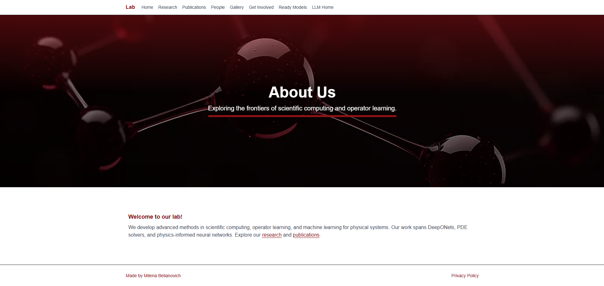

# Operator Learning & Scientific Computing Lab — Website


A **Next.js (App Router)** website for the **Operator Learning & Scientific Computing Lab** at the **University of Utah**.  
It highlights our **research**, **publications**, **people**, **gallery**, and information on how to **get involved**, all themed in elegant maroon.

---

## Preview




---

## Overview

- **Home / Research / Publications / People / Gallery / Get Involved / Ready Models / LLM Home / Privacy**
- **Home Page**
    - Short description of the lab.
- **Research Page**
    - Displays projects and funding agencies with logos
- **Publications Page**
    - The publication list is fetched and saved **statically** via `scripts/update-publications.mjs`.
    - Renders inline LaTeX in titles using **KaTeX**
    - Highlights lab members’ names in bold
    - The query excludes works before 2015 to avoid early, unrelated publications.
- **People Page**
    - Advisor section with extended bio + links (Google Scholar, LinkedIn, website)
    - Student cards with photo, title, and research area
- **Gallery Page**
    - Grid layout with photo cards (event, who, date, description)
- **Get Involved Page**
    - Email buttons that open the user’s email client or Gmail
- **Privacy Policy Page**
    - Plain-language, academic-style privacy statement
- **Ready Models and LLM Home Pages**
    - still under development

---

## Tech Stack

- **Next.js 16 (App Router)**
- **TypeScript**
- **Tailwind CSS** with a custom **maroon theme**
- **KaTeX** for inline math rendering
- **clsx** for class management

---

## Quick Start

Clone and install everything in one command:

```bash
# Clone & enter
git clone https://github.com/milenabel/labsite.git
cd labsite

# One-time dependency setup (choose one):
# macOS/Linux:
./setup.sh
# Windows PowerShell:
powershell -ExecutionPolicy Bypass -File .\setup.ps1

# Run dev server
npm run dev
# Then open: http://localhost:3000
```

---

## Node Requirements

- Node ≥ **18.17**
- If switching Node versions, delete the `.next/` folder to avoid cache and hydration issues.

---

## Scripts

| Command         | Description                |
|-----------------|----------------------------|
| `npm run dev`   | Start development server   |
| `npm run build` | Build production bundle    |
| `npm run start` | Serve production build     |
| `npm run lint`  | Lint code with ESLint      |

---

## Project Structure

```text
.github/
└── workflows/
    └── update-publications.yml     # CI job that refreshes publications JSON

public/
├── hero/                           # Section hero images 
│   ├── home.png
│   ├── research1.png               # "Research" hero
│   ├── peoples.png                 # "People" hero
│   ├── publication.png             # "Publications" hero
│   ├── hands.png                   # "Get involved" hero
│   └── privacy.png                 # "Privacy Policy" hero
├── gallery/                        # Gallery photos
│   ├── boxing.PNG
│   └── hike.jpg
├── logos/                          # Sponsor/agency logos 
├── people/                         # Profile photos 
└── preview.png                     # README splash

scripts/
└── update-publications.mjs         # arXiv to JSON generator (run locally/CI)

src/
├── app/
│   ├── llm/page.tsx                # LLM demo page
│   ├── gallery/page.tsx            # Gallery grid
│   ├── get-involved/page.tsx       # Contact/CTA page
│   ├── models/page.tsx             # LLM demo page
│   ├── people/page.tsx             # People (advisor + students)
│   ├── privacy/page.tsx            # Privacy policy
│   ├── publications/page.tsx       # Static publications renderer
│   ├── research/page.tsx           # Research projects + funding
│   ├── favicon.ico
│   ├── globals.css
│   ├── layout.tsx                  # Root layout (Nav, Footer)
│   └── page.tsx                    # Home
├── components/
│   ├── EmailLink.tsx
│   ├── Footer.tsx
│   ├── GalleryCard.tsx
│   ├── HeaderBanner.tsx
│   └── NavBar.tsx
└── data/
    ├── funding.json
    ├── gallery.json
    ├── models.json                 # extra people/aliases for queries
    ├── people.json
    ├── publications.json           # Generated by scripts/update-publications.mjs
    └── research.json
```

---

## Data Files

| File | Purpose |
|------|----------|
| `src/data/people.json` | Advisor and student info |
| `src/data/funding.json` | Funding agencies and logos |
| `src/data/research.json` | Project titles and summaries |
| `src/data/gallery.json` | Photo data for gallery page |
| `src/data/publications.json` | **Generated** publications list |

---

## Static Publications (arXiv to JSON) Fetching Logic

Publications are not fetched at runtime. Instead, we precompute a JSON that the site renders.

- Implemented in `scripts/update-publications.mjs`.
- `scripts/update-publications.mjs` queries arXiv, normalizes and filters results, and writes the JSON.
- **Filters applied:**
  - **Year ≥ 2015** (older results are discarded)
  - Must have exact last-name match  
  - Author first name == student first name or same initial  
  - Reject middle-name-only matches
- Titles are scanned for `$…$` inline math, rendered with **KaTeX**.
- Lab member names (students/advisor) are bolded in author lists.

Run locally:
```bash
npm run update:pubs
```

Run in CI (GitHub Actions)
- The workflow `.github/workflows/update-publications.yml` runs the same script and commits the updated JSON.
- You can trigger it manually (`workflow_dispatch`).
---

## Themes & Styles

- Defined in `tailwind.config.ts`
- Cards, sections, and links styled via reusable classes:
  - `.card` — padded, rounded panels with border  
  - `.section-title` — bold maroon headings  
  - `.link` — underlined maroon text  

---

## Troubleshooting

| Issue | Fix |
|-------|-----|
| Hydration mismatch warnings | Disable browser extensions that alter HTML (Grammarly, ad blockers) |
| Images not loading | Check `/public` path and file names |
| Broken KaTeX titles | Ensure `$…$` pairs are balanced in arXiv titles |

---

## Assets & Licensing

All background and header images across the site (Research, People, Publications, Gallery,  
Get Involved, Privacy) are **AI-generated** specifically for this project.  
They are owned exclusively by the **Operator Learning & Scientific Computing Lab** and  
are **not derived from or associated with any third party**.

These assets are released under the same **MIT License** as the site’s source code unless otherwise noted.

---

## Privacy & Credits

This site follows the lab’s [Privacy Policy](/privacy).

© 2025 **Operator Learning & Scientific Computing Lab**, University of Utah.  
Site built by **Milena Belianovich**.