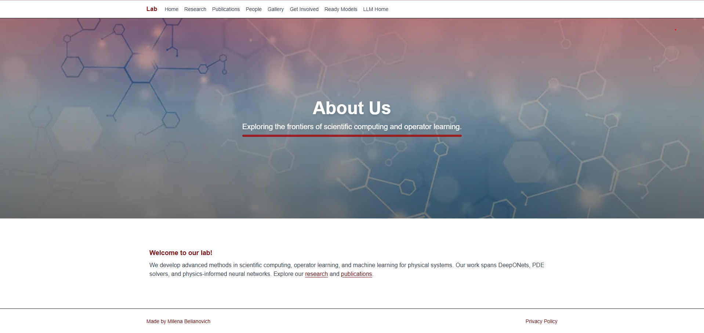

# Operator Learning & Scientific Computing Lab — Website


A **Next.js (App Router)** website for the **Operator Learning & Scientific Computing Lab** at the **University of Utah**.  
It highlights our **research**, **publications**, **people**, **gallery**, and information on how to **get involved**, all themed in elegant maroon.

---

## Preview




---

## Overview

- **Home / Research / People / Gallery / Get Involved / Publications / Privacy**
- **People Page**
    - Advisor section with extended bio + links (Google Scholar, LinkedIn, website)
    - Student cards with photo, title, and research area
- **Publications Page**
    - Auto-fetches papers from **arXiv** using student/alumni names
    - Renders inline LaTeX in titles using **KaTeX**
    - Highlights lab members’ names in bold
- **Research Page**
    - Displays projects and funding agencies with logos
- **Gallery Page**
    - Grid layout with photo cards (event, who, date, description)
- **Get Involved**
    - Email buttons that open the user’s email client or Gmail
- **Privacy Policy**
    - Plain-language, academic-style privacy statement

---

## Tech Stack

- **Next.js 16 (App Router)**
- **TypeScript**
- **Tailwind CSS** with a custom **maroon theme**
- **KaTeX** for inline math rendering
- **xml2js** for parsing arXiv XML feeds
- **clsx** for class management

---

## Quick Start

Clone and install everything in one command:

```bash
# Clone & enter
git clone https://github.com/milenabel/labsite.git
cd labsite

# One-time dependency setup (choose one):
# macOS/Linux:
./setup.sh
# Windows PowerShell:
powershell -ExecutionPolicy Bypass -File .\setup.ps1

# Run dev server
npm run dev
# Then open: http://localhost:3000
```

---

## Node Requirements

- Node ≥ **18.17**
- If switching Node versions, delete the `.next/` folder to avoid cache and hydration issues.

---

## Scripts

| Command         | Description                |
|-----------------|----------------------------|
| `npm run dev`   | Start development server   |
| `npm run build` | Build production bundle    |
| `npm run start` | Serve production build     |
| `npm run lint`  | Lint code with ESLint      |

---

## Project Structure

```text
src/
├── app/
│   ├── page.tsx                # Home
│   ├── research/page.tsx       # Research projects + funding
│   ├── people/page.tsx         # People profiles (advisor + students)
│   ├── gallery/page.tsx        # Gallery grid
│   ├── get-involved/page.tsx   # Contact info
│   ├── publications/page.tsx   # ArXiv fetch + render
│   └── privacy/page.tsx        # Privacy policy
├── components/                 # Header, Footer, Cards, etc.
├── data/                       # JSON data files (people, gallery, etc.)
└── lib/                        # ArXiv fetch + utilities
```

---

## Data Files

| File | Purpose |
|------|----------|
| `src/data/people.json` | Advisor and student info |
| `src/data/funding.json` | Funding agencies and logos |
| `src/data/research.json` | Project titles and summaries |
| `src/data/gallery.json` | Photo data for gallery page |


---

## arXiv Fetching Logic

- Implemented in `src/lib/arxiv.ts`.
- Fetches XML feeds for each student/alumnus using **xml2js**.
- **Filters results:**
  - Must have exact last-name match  
  - Author first name == student first name or same initial  
  - Rejects middle-name-only matches
- Titles are parsed for `$…$` inline math, rendered with **KaTeX**.
- Student and advisor names are bolded.

---

## Themes & Styles

- Defined in `tailwind.config.ts`
- Cards, sections, and links styled via reusable classes:
  - `.card` — padded, rounded panels with border  
  - `.section-title` — bold maroon headings  
  - `.link` — underlined maroon text  

---

## Troubleshooting

| Issue | Fix |
|-------|-----|
| Hydration mismatch warnings | Disable browser extensions that alter HTML (Grammarly, ad blockers) |
| Images not loading | Check `/public` path and file names |
| Module not found: xml2js/katex/clsx | Run `./setup.sh` or `setup.ps1` again |
| Broken KaTeX titles | Ensure `$…$` pairs are balanced in arXiv titles |

---

## Privacy & Credits

This site follows the lab’s [Privacy Policy](/privacy).

© 2025 **Operator Learning & Scientific Computing Lab**, University of Utah.  
Site built by **Milena Belianovich**.